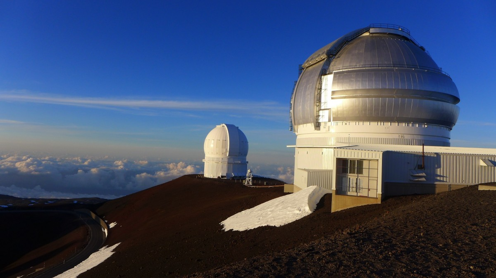

```{r, echo=FALSE}
# This code will display the QMUL logo at the top right of the page
# Do not change this code
htmltools::img(src = knitr::image_uri("images/QMlogo.png"),
               alt = 'logo',
               style = 'position:absolute; top:0; right:0; padding:10px; width:20%;')
```
# Overview
The purpose of this project was to analyse and forecast atmospheric carbon dioxide $(CO_2)$ concentrations using time series analysis and Meta's Prophet forecasting model. The dataset used contained monthly atmospheric $CO_2$ concentrations that were recorded at the Mauna Loa Observatory in Hawaii between January 1959 and December 2025. 

An initial visual analysis was conducted which revealed a clear upward trend and a yearly seasonal pattern. Statistical techniques such as time series decomposition, linear regression and autocorrelation (ACF) analysis were used to further investigate these patterns which supported our initial visual analysis.

The Prophet forecasting model was used to generate forecasts for the next 120 and 240 months. The forecasts suggested that atmospheric $CO_2$ concentrations would continue to increase with a yearly seasonal pattern, which was observed in the historical data.


 
## 0.1 Libraries
This project will need multiple R packages to help support the analysis and forecasting of the time series.
```{r message=FALSE, warning=FALSE}
library(prophet)
library(zoo)
library(ggplot2)
```

## 0.2 The Data
The dataset used in this analysis contains 804 observations of atmospheric carbon dioxide $(CO_2)$ concentrations measured in parts per million (ppm). Each observation represents the average atmospheric carbon dioxide $(CO_2)$ concentrations for the month. This data was collected monthly from January 1959 to December 2025 at the Mauna Loa Observatory in Hawaii by the National Oceanic and Atmospheric Administration (NOAA). This dataset can be found [here](https://scrippsco2.ucsd.edu/data/atmospheric_co2/primary_mlo_co2_record.html).

The dataset was first cleaned before being imported into R. Unnecessary columns were removed so the dataset only contained the filled $(CO_2)$ levels for each month. By using the filled $(CO_2)$ values it ensured any missing data between 1959 and 2025 was replaced by interpolated values. Observations from the year 1958 were also removed as early observation were missing values.

```{r}
monthly_co2_data = read.csv('data/monthly_co2.csv')
class(monthly_co2_data$co2)
head(monthly_co2_data)
```
The dataset was imported into R and the structure of the data was checked to ensure the $CO_2$ values were stored as numeric data.


# 1 Time Series Analysis

## 1.1 Constructing the Time Series

A time series was created with the monthly $CO_2$ values to allow time series analysis.
```{r}
co2_ts = ts(monthly_co2_data$co2, start = c(1959,1), frequency = 12)
```


```{r}
summary(co2_ts)
```
The summary shows that atmospheric $CO_2$ concentrations range from 313.3ppm to 430.2ppm with a mean of 361.0ppm and a median of 356.0ppm.

The dataset can be visualised using a time series plot shown below.

```{r}
plot(co2_ts, main = "Monthly atmospheric CO2 concentrations from 1959 to 2025", xlab = "Year", ylab = "CO2 concentrations (ppm)")
```

## 1.2 Initial Visual Trend and Seasonality Analysis
The time series plot shows a clear upward trend line, suggesting that atmospheric $CO_2$ concentrations have increased at a steady rate between 1959 and 2025. Also the small yearly fluctuations indicate seasonality, where $CO_2$ concentration levels rise at the start of each year and drop towards the end. 

## 1.3 Time Series Decomposition
The time series can be decomposed into its main 3 components, trend $(m_t)$, seasonal $(S_t)$ and random noise $(Y_t)$. 

This will help us better analyse the structure of the time series.
```{r}
co2_decompose = decompose(co2_ts)
plot(co2_decompose)
```

From the decomposition plot we can make the following observations:

- The trend component shows a clear upward movement over time which confirms that atmospheric $CO_2$ concentrations have steadily increased throughout the period.

- The seasonal component confirms the presence of a seasonal fluctuation in our time series as there is a repeated yearly pattern.

- The random component represents the small random fluctuation which cannot be explained by the trend or seasonal component.

## 1.4 Linear Regression Trend Analysis
A linear regression model can be fitted to the data to see the relationship between time and atmospheric $CO_2$ concentrations. This model assumes a linear relationship between the 2 variables. The linear model will describe the overall trend in the data but will not reflect the seasonal pattern in the data.

The following shows a summary of the linear model.
```{r}
time_index = 1:length(co2_ts)
linear_model = lm(co2_ts ~ time_index)
summary(linear_model)
```

From the linear regression model we can make the following observations:

- The estimated coefficient for the time is 0.1388, meaning that atmospheric $CO_2$ concentration increases by  0.1388ppm per month on average.

- The p value is also very small (p<2.2e-16), indicating the linear relationship between time and atmospheric $CO_2$ concentration is statistically significant.

- Also the $R^2$ value is equal to 0.9756, meaning that 97.56% of the variability is accounted for by the linear model. 

```{r}
plot(time_index, as.numeric(co2_ts), type = "l", main = "CO2 Time Series with Linear Trend", xlab = "Months since January 1959", ylab = "CO2 Concentration (ppm)")

lines(time_index, fitted(linear_model), col = "red", lwd = 2)
```

We can see that the linear model fits the overall trend really well even though there is noticeable fluctuations around the line.

## 1.5 Seasonality Analysis
An autocorrelation function (ACF) plot can be used to analyse the structure of the seasonal component particularly the seasonal period.

```{r}
acf(co2_ts, lag.max = 60, main = "Autocorrelation Function of CO2 Time Series")
```

Peaks in the autocorrelation appearing at lags 1, 2, 3, 4 and 5 suggest that there is a repeating seasonal pattern. Since the time series contains monthly observations, lag 1 represents a period of 12 months, suggesting a yearly seasonal pattern.


# 2 Prophet Forecasting

## 2.1 What is the Prophet Model
Prophet is a time series forecasting tool developed by Meta in 2017. It was designed to analyse and forecast time series data by decomposing the data into trend, seasonal and random components. Prophet predicts future values of a time series while taking into account uncertainty over time. It works well with data that has strong trends and repeating seasonal patterns.

## 2.2 Data Preparation
Before we fit the Prophet model we need to convert the dataset into the required format needed for the Prophet. The Prophet model requires the data to be stored in a dataframe with 2 columns, ds and y. The ds column represents the dates and the y column represents the observed values of the time series.
```{r}
co2_df = data.frame(ds = as.Date(as.yearmon(time(co2_ts))), y = as.numeric(co2_ts))
head(co2_df)
```

The first few rows of the dataframe are displayed to verify that the data has been converted correctly.

## 2.3 Prophet Model
To fit the Prophet model we use the dataframe containing the columns ds and y.

```{r}
prophet_model = prophet(co2_df)
```

Since the data contains monthly observations, daily and weekly seasonality are not relevant and not included in the model. The Prophet model is now fitted and can be used to generate forecast for future values.

## 2.4 Forecasting
Before we can generate a forecast we need to create a dataframe containing the future date we want to predict. We will create 2 dataframes, one to predict the next 120 months and another to predict the next 240 months.

```{r}
future_120_months = make_future_dataframe(prophet_model, periods = 120, freq = "month")
future_240_months = make_future_dataframe(prophet_model, periods = 240, freq = "month")
```

Now we will generate the prediction for both dataframes.
```{r}
forecast_predictions_120 = predict(prophet_model, future_120_months)
forecast_predictions_240 = predict(prophet_model, future_240_months)
```

The forecasts for the next 120 months can be visualised using forecast plot below.
```{r}
plot(prophet_model, forecast_predictions_120) + labs(title = "120 Month Forecast of Atmospheric CO2", x = "Year", y = "CO2 Concentration (ppm)")
```

The forecasts for the next 240 months can be visualised using forecast plot below.
```{r}
plot(prophet_model, forecast_predictions_240) + labs(title = "240 Month Forecast of Atmospheric CO2", x = "Year", y = "CO2 Concentration (ppm)")
```

Understanding the forecast plots:

- The black points represent the observed atmospheric $CO_2$ concentration  from the historical data.

- The blue line represents the predicted atmospheric $CO_2$ concentration generated from the Prophet model.

- The shaded region represents the uncertainty interval around the predicted atmospheric $CO_2$ concentration.

Both forecast plots show a continued upward trend in atmospheric $CO_2$ concentration, this reflects the trend we saw originally in the historical data. The 120 and 240 month forecast plot both capture the seasonal fluctuations that we also saw in the time series. However the uncertainty interval becomes greater in the 240 month forecast plot as predictions further into the future are less certain.

## 2.5 Interactive Forecasting Plots
An interactive dygraph can also be used to visualise the forecasted values.

The forecasts for the next 120 months can be visualised below.
```{r warning=FALSE}
dyplot.prophet(prophet_model, forecast_predictions_120, xlab="Year", ylab="CO2 Concentration (ppm)", main="120 Month Forecast of Atmospheric CO2")
```

The forecasts for the next 240 months can be visualised below.
```{r warning=FALSE}
dyplot.prophet(prophet_model, forecast_predictions_240, xlab="Year", ylab="CO2 Concentration (ppm)", main="240 Month Forecast of Atmospheric CO2")
```

## 2.6 Prophet Components
The Prophet model also allows us to analyse the different components of the time series (the trend and seasonal pattern).

The Prophet components for the 120 month forecast is given below.
```{r}
prophet_plot_components(prophet_model, forecast_predictions_120)
```

The Prophet components for the 240 month forecast is given below.
```{r}
prophet_plot_components(prophet_model, forecast_predictions_240)
```

From the Prophet component plots we can see that the trend component shows a steady long term increase in atmospheric $CO_2$ concentration over time. However the uncertainty region around the trend line becomes greater in the 240 month forecast compared to the 120 month forecast, this reflects the uncertainty in long term predictions. The seasonal component shows an identical yearly atmospheric $CO_2$ concentration pattern in the 120 and 240 month forecast, this is because the Prophet model assumes that the seasonal pattern remains constant over time, so the yearly pattern is repeated in the forecast. The pattern indicates that the atmospheric $CO_2$ concentration increases between the months October to May and deceases between the months May to October.


# 3 Conclusion

## 3.1 Limitations
The Prophet model provides useful forecasts but there are a few limitations to consider. The model assumes that the patterns observed in the historical data such as the upward trend line and the seasonal cycle will continue in the future, however it does not consider external unexpected factors. For example, volcano activity from Mauna Loa could release gases into the atmosphere which may rise the atmospheric $CO_2$ levels. Also Hawaii is a tourist heavy location and increases or decreases in tourism could affect the $CO_2$ emissions due to changes in transportation and energy usage. The dataset also only contains atmospheric $CO_2$ concentrations from 1 location, Mauna Loa, which may not represent the global atmospheric $CO_2$ levels. The data also contained a few missing values that were replaced by interpolated values, which may add small inaccuracies into the model.

## 3.2 Discussion and Conclusion
Our initial visual analysis indicated a long term upward trend line and seasonal fluctuation for atmospheric $CO_2$ concentration measured at Mauna Loa Observatory in Hawaii. The time series plotted showed atmospheric $CO_2$ concentration increased steadily between 1959 and 2025, while a yearly repeated pattern indicated a seasonal component.

Statistical analysis was preformed on the time series to further support our initial visual analysis. The decomposition of the time series broke down the series into its 3 main component. The trend component showed a clear upward trend which supported our original analysis. Also the seasonal component had a yearly pattern which confirmed the presence of the seasonal component. 

A linear regression model was fitted to the data which showed a strong linear relationship between time and atmospheric $CO_2$ concentration, the small p value (p<2.2e-16) further confirmed this. The high $R^2$ (97.56%) shows that a lot of the variability can be explained by the linear trend over time. The model also indicated that on average atmospheric $CO_2$ concentration increase by 0.1388ppm per month.

An ACF plot was used to further analyse the seasonal period of the data. The plot showed peaks at lag 1, 2, 3, 4 and 5. Since the data contained monthly observations lag 1 represents 12 months. This supports the observation that the time series has a repeating yearly pattern.

The Prophet forecast plots for the next 120 and 240 months also supported these observations. Both forecast plots showed a continued upward trend line with yearly seasonality, however the 240 month forecast had a wider uncertainty interval as predictions further into the future are less certain. Looking more closely into the seasonality component we can see that atmospheric $CO_2$ concentration increases between months October to May and decreases between months May to October. One explanation for this could be increased plant growth during summer which lowers atmospheric $CO_2$ concentration as more $CO_2$ is absorbed by plants for photosynthesis. Hawaii only has 2 main seasons summer and winter. Summer occurs in months from May to October while Winter occurs in months from November to April. This closely matches the pattern seen in our seasonal component, which shows decreasing atmospheric $CO_2$ concentration during the Summer months and increasing atmospheric $CO_2$ concentration during the Winter months.

Overall, the results of the analysis show that atmospheric $CO_2$ concentration is influenced by both a long term upward trend and a yearly seasonal component, which matches Hawaii seasonal environment. The Prophet forecasting method also successfully captured these patterns and produced forecasts which maintained the observed trend and seasonality, however there is a few limitations to consider such as external factors and dataset limitations which could affects future atmospheric $CO_2$ concentrations.


# References

- Mauna Loa Observatory picture: <https://pxhere.com/en/photo/556564>
- Rmarkdown tutorial: <https://www.youtube.com/watch?v=asHhuHRxhvo>
- $CO_2$ dataset <https://scrippsco2.ucsd.edu/data/atmospheric_co2/primary_mlo_co2_record.html>
- Hawaii seasons: <https://www.gohawaii.com/trip-planning/weather>
- Plants absorb $CO_2$: <https://www.rhs.org.uk/advice/understanding-plants/how-plants-breathe#:~:text=cells%20for%20photosynthesis-,Photosynthesis%20is%20the%20process%20by%20which%20plants%20make%20their%20own,the%20leaf%20from%20the%20atmosphere.>
- Prophet information <https://facebook.github.io/prophet/docs/quick_start.html#r-api>
- Prophet article<https://medium.com/data-science/linkedins-response-to-prophet-silverkite-and-greykite-4fd0131f64cb>
- Hawaii tourism <https://www.hawaiibusiness.com/overtourism/>
